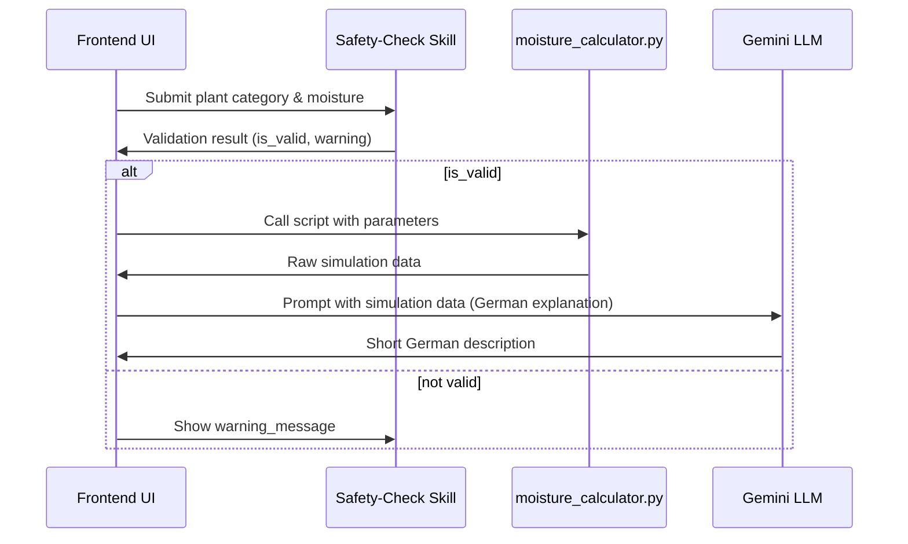

# Conversation Log 5: Prompt Documentation & System Overview

**Date:** June 26, 2026  
**Participants:** User & Antigravity (AI Coding Assistant)  
**Topic:** Documentation of prompts, safety validation checks, weather data integration, and guidelines for botanical watering calculation workflow.

---

## 1. Skill Prompt Patterns
### 1.1 Safety‑Check Skill (`skills/safety-check-skill`)
- **Purpose**: Verify that user‑provided plant data and environment settings are safe before any calculation.
- **Core Prompt Template**:
  ```markdown
  **Task**: Validate the following plant‑care parameters.
  - Plant category: {{category}}
  - Current soil moisture (%): {{moisture}}
  - Desired watering interval (days): {{interval}}
  **Rules**:
  1. Moisture must be between 0 and 100.
  2. Interval must be a positive integer.
  3. If any value is out of range, return a short German warning message.
  ```
- **Response Model** (Pydantic):
  ```python
  class SafetyCheckResult(BaseModel):
      is_valid: bool
      warning_message: Optional[str]
  ```

### 1.2 Botanical‑Watering Skill (`skills/botanical-watering-skill`)
- **Purpose**: Compute deterministic soil‑moisture dynamics and generate a concise German explanation for the UI.
- **Prompt Flow**:
  1. **Input Gathering** – collect category, recent weather data, and user‑specified preferences.
  2. **Call Deterministic Script** – invoke `moisture_calculator.py` with the structured parameters.
  3. **LLM Explanation Prompt** – feed the script’s numeric result to Gemini and ask for a 1‑2 sentence German description.
- **Example Prompt for Gemini**:
  ```markdown
  Du bist ein Experte für Pflanzenpflege. Basierend auf den folgenden Berechnungen:
  - Aktuelle Bodenfeuchte: {{current_moisture}} %
  - Erwartete Feuchte nach 24 h: {{next_moisture}} %
  - Empfohlene Gießzeit: {{next_watering}} Uhr
  Formuliere eine kurze, freundliche Erklärung (max. 2 Sätze) für den Nutzer, warum das Ergebnis sinnvoll ist.
  ```

---

## 2. UI Prompt Integration (Frontend)
- **Dropdown Selection** – Prompt the LLM to generate the tooltip text for each plant‑category option.
  ```markdown
  Beschreibe in einem Satz, was die Kategorie "{{category_name}}" charakterisiert und welche Pflege sie benötigt.
  ```
- **LocalStorage Sync** – When persisting the last calculation, use a prompt to ask the model to summarize the session for later retrieval.
  ```markdown
  Fasse das aktuelle Wassergieß‑Ergebnis zusammen: Kategorie, aktuelle Feuchte, empfohlener Zeitpunkt. Gib den Text als JSON‑String zurück.
  ```

---

## 3. MCP Server Prompting (`mcp/weather-geocoding`)
- **Weather Retrieval Prompt** – The MCP server does not need an LLM prompt, but the surrounding orchestration does. Use a concise instruction set:
  ```markdown
  Fetch hourly temperature, humidity, and precipitation for the last 7 Tage at latitude {{lat}} und longitude {{lon}} using Open‑Meteo. Return a JSON array ordered chronologisch.
  ```
- **Error Handling Prompt** – If the API fails, ask Gemini for a fallback suggestion:
  ```markdown
  Der Wetter‑API‑Aufruf war nicht erfolgreich. Schlage dem Nutzer eine alternative Berechnungsmethode vor, die nur die durchschnittliche Tages‑Temperatur nutzt.
  ```

---

## 4. General Prompt Best Practices
1. **Keep Prompts Short & Structured** – Use bullet points or key‑value pairs. The LLM parses better when data is clearly delineated.
2. **German Language Consistency** – All user‑facing explanations must be in German, matching the project’s target audience.
3. **Explicit Output Formats** – Always specify the expected output type (e.g., JSON, plain text, short sentence).
4. **Safety Checks First** – Validate inputs before any heavy computation to avoid unnecessary processing.
5. **Deterministic Core** – Let the Python script handle all numeric heavy‑lifting; the LLM only crafts narrative text.

---

## 5. Example End‑to‑End Prompt Sequence


---

## 6. Revision History
| Date | Author | Change |
|------|--------|--------|
| 2026-06-26 | Antigravity | Initial creation after conversation_log_4.md |
